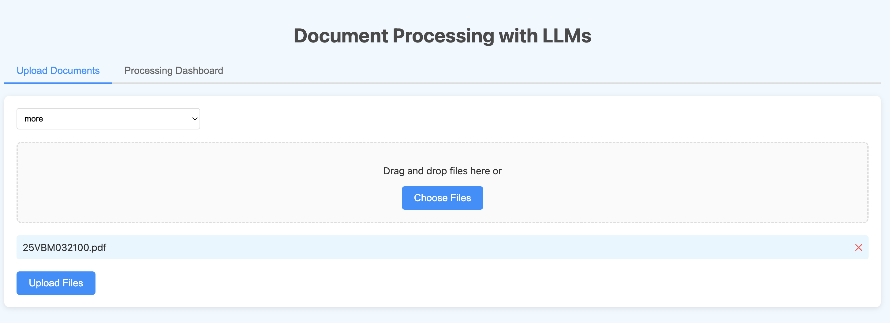

# LLM document extraction asynchronous pipeline



This is a demo of a document processing pipeline that uses Dapr to orchestrate an asynchronous pipeline of document processing tasks. Depending on how you configure the app, you might need the following services:

- Dapr: uses the state store and pub/sub broker
- Azure Document Intelligence: used to crack documents
- Azure OpenAI: used to extract data from documents
- Groq: used to extract data from documents
- Ollama: used to extract data from documents
- Azure Event Grid: used to send the output to a channel
- Pusher: used to send the output to a channel
- Redis: used as the state store and pub/sub broker (via Dapr; Redis is deployed as part of the Dapr installation; requires Docker)
- Apache Tika: used to crack documents
- Azure Storage Account: used to temporarily store documents

## Run with Catalyst

**Note:** skip to the Dapr section if you do not want to use Catalyst. Dapr will be easier to run locally.

Instead of installing Dapr on the local machine or Kubernetes, this demo can also use Catalyst. In fact, this app was written as a Catalyst demp app. Catalyst is a Dapr-compatible  cloud-based runtime. Here we use it to build and run the app locally but you can also deploy these services to the cloud.

To run the demo, you need to install the diagrid CLI, authenticate and ensure the correct project is selected. Please see the following blog post for details: https://blog.baeke.info/2024/09/13/writing-an-multi-service-document-extractor-with-the-help-of-diagrids-catalyst/

Next, run diagrid dev scaffold. That creates a dev-idpdemo.yaml file in the current directory. You need to edit the file to set the correct values for the environment variables:

```yaml
project: idpdemo
apps:
- appId: process
  disabled: true
  appPort: 8001
  env:
    DAPR_API_TOKEN: [Dapr API token for authentication - should be set by scaffold]
    DAPR_APP_ID: [Identifier for the Dapr application - should be set by scaffold]
    DAPR_CLIENT_TIMEOUT_SECONDS: [Timeout duration for Dapr client in seconds]
    DAPR_GRPC_ENDPOINT: [gRPC endpoint for Dapr communication - should be set by scaffold]
    DAPR_HTTP_ENDPOINT: [HTTP endpoint for Dapr communication - should be set by scaffold]
    STORAGE_ACCOUNT_NAME: [Name of the Azure storage account]
    STORAGE_ACCOUNT_KEY: [Access key for the Azure storage account]
    CONTAINER_NAME: [Name of the container in Azure storage]
    DOCINT_KEY: [API key for document intelligence service]
    DOCINT_URL: [URL for document intelligence service]
    OPENAI_KEY: [API key for OpenAI service]
    AZURE_OPENAI_KEY: [API key for Azure OpenAI service]
    AZURE_OPENAI_ENDPOINT: [Endpoint URL for Azure OpenAI service]
    AZURE_OPENAI_MODEL: [Specific model to use with Azure OpenAI]
    AZURE_OPENAI_API_VERSION: [API version for Azure OpenAI service]
    INVOICE_EXTRACTOR_TYPE: [Type of invoice extractor to use; openai or groq]
    INVOICE_OUTPUT_HANDLER: [Type of output handler for invoice processing; json or csv]
    GROQ_API_KEY: [API key for Groq service]
    EVENT_GRID_TOPIC_ENDPOINT: [Endpoint URL for Azure Event Grid topic]
    EVENT_GRID_TOPIC_KEY: [Access key for Azure Event Grid topic]
    EVENT_GRID_TOPIC_NAME: invoices
  workDir: process
  command: ["python", "app.py"]
- appId: upload
  appPort: 8000
  env:
    DAPR_API_TOKEN: [Dapr API token for authentication - should be set by scaffold]
    DAPR_APP_ID: [Identifier for the Dapr application - should be set by scaffold]
    DAPR_CLIENT_TIMEOUT_SECONDS: [Timeout duration for Dapr client in seconds]
    DAPR_GRPC_ENDPOINT: [gRPC endpoint for Dapr communication - should be set by scaffold]
    DAPR_HTTP_ENDPOINT: [HTTP endpoint for Dapr communication - should be set by scaffold]
    STORAGE_ACCOUNT_NAME: [Name of the Azure storage account]
    STORAGE_ACCOUNT_KEY: [Access key for the Azure storage account]
    CONTAINER_NAME: [Name of the container in Azure storage]
  workDir: upload
  command: ["python", "app.py"]
appLogDestination: ""
```

With the scaffold created, you can run the demo with diagrid dev start. First ensure that you have a Python environment. Install the following packages:

```bash
cloudevents==1.10.1
dapr==1.11.0
fastapi==0.111.0
grpcio==1.62.1
pydantic==2.4.2
requests==2.32.0
uvicorn==0.23.2
aiohttp==3.10.2
azure-ai-documentintelligence==1.0.0b3
azure-core==1.30.2
azure-storage-blob==12.22.0
groq==0.11.0
ollama==0.4.5
```

You can install the packages with the following command:

```bash
pip install -r requirements.txt
```

## Run with Dapr

Install Dapr on your local machine. This requires Docker. As part of the Dapr installation, a Redis instance will be deployed. That Redis instance will be used as the state store and pub/sub broker. When you move the app to the cloud, you can use a cloud-based state store and pub/sub broker without changing the app.

Clone the repo and First ensure that you have a Python environment. The following packages are required:

```bash
cloudevents==1.10.1
dapr==1.11.0
fastapi==0.111.0
grpcio==1.62.1
pydantic==2.4.2
requests==2.32.0
uvicorn==0.23.2
aiohttp==3.10.2
azure-ai-documentintelligence==1.0.0b3
azure-core==1.30.2
azure-storage-blob==12.22.0
groq==0.11.0
ollama==0.4.5
```

You can install the packages with the following command:

```bash
pip install -r requirements.txt
```

Next, create an Azure Storage Account and a container in the storage account. You need to set the `STORAGE_ACCOUNT_NAME` and `STORAGE_ACCOUNT_KEY` environment variables in the dapr.yaml file below. Also set the `CONTAINER_NAME` environment variable.

If you use the `document_intelligence` cracker, you need to set the `DOCINT_KEY` and `DOCINT_URL` environment variables. These are the API key and endpoint URL for the Azure Document Intelligence service. Ensure that the Document Intelligence service is deployed in Azure.

If you use the OpenAI extractor, in Azure, create an Azure OpenAI service and set the `AZURE_OPENAI_KEY`, `AZURE_OPENAI_ENDPOINT`, `AZURE_OPENAI_MODEL`, `AZURE_OPENAI_API_VERSION` environment variables. Use the gpt-4o model.

To run with Dapr, add a dapr.yaml file to the root of the project with the following content:

```yaml
version: 1
apps:
  - appID: process
    appDirPath: ./process
    appPort: 8001
    command: ["python", "app.py"]
    env:
      STORAGE_ACCOUNT_NAME: [Name of the Azure storage account]
      STORAGE_ACCOUNT_KEY: [Access key for the Azure storage account]
      CONTAINER_NAME: [Name of the container in Azure storage]
      DOCINT_KEY: [API key for Azure Document Intelligence service]
      DOCINT_URL: [Endpoint URL for Azure Document Intelligence service]
      OPENAI_KEY: [API key for OpenAI service]
      AZURE_OPENAI_KEY: [API key for Azure OpenAI service]
      AZURE_OPENAI_ENDPOINT: [Endpoint URL for Azure OpenAI service]
      AZURE_OPENAI_MODEL: [Name of the Azure OpenAI model to use]
      AZURE_OPENAI_API_VERSION: [API version for Azure OpenAI service]
      INVOICE_EXTRACTOR_TYPE: [Type of invoice extractor to use (e.g., 'openai' or 'groq' or 'ollama')]
      INVOICE_OUTPUT_HANDLER: [Type of output handler for invoice data (e.g., 'json' or 'csv' or 'pusher' or 'event_grid')]
      GROQ_API_KEY: [API key for Groq service]
      KVSTORE_NAME: statestore
      PUBSUB_NAME: pubsub
      EVENT_GRID_TOPIC_ENDPOINT: [Endpoint URL for Azure Event Grid topic]
      EVENT_GRID_TOPIC_KEY: [Access key for Azure Event Grid topic]
      EVENT_GRID_TOPIC_NAME: your-event-grid-topic-name
      CRACKER_TYPE: tika OR document_intelligence
  - appID: upload
    appDirPath: ./upload
    appPort: 8000
    command: ["python", "app.py"]
    env:
      STORAGE_ACCOUNT_NAME: [Name of the Azure storage account]
      STORAGE_ACCOUNT_KEY: [Access key for the Azure storage account]
      CONTAINER_NAME: [Name of the container in Azure storage]
      PUBSUB_NAME: pubsub
      KVSTORE_NAME: statestore
```

Run the app with `dapr run -f .`

Open the UI at http://localhost:8001/ui. You should be able to upload a document and see the output in the UI. The dashboard requires Pusher and only grabs real-time data. When you refresh the page or you click Clear All Events button, the data will be lost.

## Crackers

Crackers are used to **crack** a document type and covert it to text. The following crackers are supported:

- Azure Document Intelligence
- Apache Tika

To configure the cracker, set the `CRACKER_TYPE` environment variable to the desired cracker type (in dapr.yaml):

- document_intelligence
- tika

If you use the `document_intelligence` cracker, you need to set the `DOCINT_KEY` and `DOCINT_URL` environment variables. These are the API key and endpoint URL for the Azure Document Intelligence service. Ensure that the Document Intelligence service is deployed in Azure.

When you use the `tika` cracker, you need to run the Tika server locally. You can do this by running the following command:

```bash
docker run -d -p 9998:9998 apache/tika:latest
```

This will start the Tika server and you can use it to crack documents. At present, you cannot configure the Tika URL.

## Extractors

Extractors are used to **extract** data from a document. The following extractors are supported:

- OpenAI
- Groq
- Ollama

To configure the extractor, set the `EXTRACTOR_TYPE` environment variable to the desired extractor type:

- openai
- groq
- ollama

To use the `openai` extractor, you need to set several environment variables:

- AZURE_OPENAI_KEY
- AZURE_OPENAI_ENDPOINT
- AZURE_OPENAI_MODEL
- AZURE_OPENAI_API_VERSION

Only Azure OpenAI is supported at present.

The OpenAI extractor uses structured outputs.

To use the `groq` extractor, you need to set the `GROQ_API_KEY` environment variable. This is the API key for the Groq service.

The Groq extractor uses JSON mode, not structured outputs.

To use the `ollama` extractor, you need to set the `OLLAMA_MODEL` environment variable. This is the model to use for the Ollama service. Ensure Ollama is running and the model is available.

The Ollama extractor uses structured outputs, similar to the OpenAI extractor. 

**Note:** You can use the OpenAI compatibility of Ollama to work with structured outputs. Here, we have used the ollama Python package to work with structured outputs.

## Output handlers

Output handlers are used to **handle** the output of the extractor. The following output handlers are supported:

- pusher: uses the Pusher service to send the output to a channel; provide the Pusher credentials in the dapr.yaml file
- json: writes the output to a JSON file; file will be written to the process directory
- csv: writes the output to a CSV file; file will be written to the process directory
- event_grid: sends the output to an Azure Event Grid topic; provide the Event Grid credentials in the dapr.yaml file

You can use multiple output handlers at the same time. For example, you can use the `pusher` and `json` output handlers to send the output to a channel and write it to a JSON file.